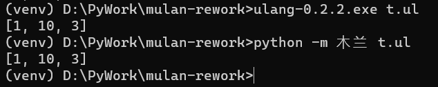
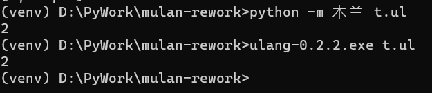
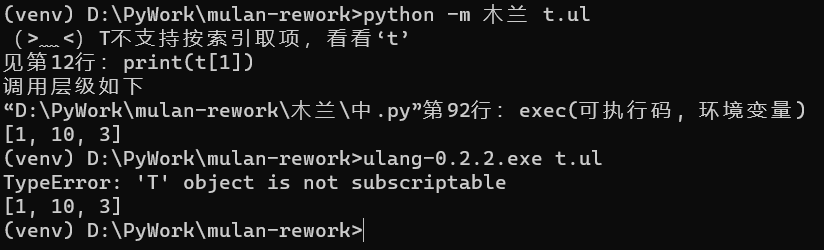

## 重载操作符语法范式

此语法用来重载自定义类型的操作符，除实现原操作符功能外，还可以修改为其它功能，比如把自定义类型T的对象加3 `T() + 3` ，语义变成3次幂。

```
// 默认行为
type P : str {
    operator + (a) {
        return str(self) + str(a) + '啊'
    }
    
    {}
}
a = P("你")
b = P("好")
print(a+b)  // 输出“你好啊”

// 转换行为
type T : int {
    operator + (p) {
        return int(self) ^ p
    }
    
    {}
}
print(T(2) + 3)  // 输出“8”
```

```
// 示例样式
type 某类型名 {
    
    operator 二元操作符 (参数) {
        // 实现部分
        return ...
    }

    operator 一元操作符 {
        // 实现部分
        return ...
    }

    operator - {
        // 实现部分
        return ...
    }
}
```

支持重载的操作符，完整说明见此 [文档](../语法说明.md) 中“二元操作符”与“一元操作符” 部分。
完整测试用例 [在此](../../测试/类型/操作符/定义操作符.ul)。

### 操作符“[]”重载问题
重载 `[]` 有单参数和双参数方式，以下为两种方式的示例及结果。

双参数：
```
type T {
    func $T(){ self.items = [1,2,3] }
    /*operator [ ] (p) { return self.items[p] } */
    operator [ ] (p1, p2) {
        self.items[p1] = p2
        return self.items
    }
}
t = T()
t[1] = 10
print(t.items)
// print(t[1])
```
执行结果：


单参数：
```
type T {
    func $T(){ self.items = [1,2,3] }
    operator [ ] (p) { return self.items[p] }
    /*operator [ ] (p1, p2) {
        self.items[p1] = p2
        return self.items
    }*/
}
t = T()
//t[1] = 10
//print(t.items)
print(t[1])
```
执行结果：


仅重载双参数时，调用单参数功能会报错：
```
type T {
    func $T(){ self.items = [1,2,3] }
    /*operator [ ] (p) { return self.items[p] } */
    operator [ ] (p1, p2) {
        self.items[p1] = p2
        return self.items
    }
}
t = T()
t[1] = 10
print(t.items)
print(t[1])
```
执行结果：


重载方式，单操作符为：
`operator [] (序号) {...}`
含义为取第“序号”项的值。

双参数为： 
`operator [] (序号, 值) {...}`
含义为设置“序号”项的值为“值”。

### 操作符“减”的问题
作为“减法运算”时，以二元操作符方式重载：
```
type T { operator - (参数) {...} }
v = T() - ...
```

作为“负号”时，使用无操作数方式重载：
```
Type T { operator - {...} }
v = - T()
```

另外做为“负号”重载时不能使用 `operator - () {...}` 这种无操作数语法，
原因待研究。把“小括号”优先级放“点点”之后，使用这种方式会报语法错误'没认出这个词 ")" '，与原始木兰行为相同；如果将其置于最后，单独重载“负号”，测试用例运行无误，同时重载“减法运算”会报错。
